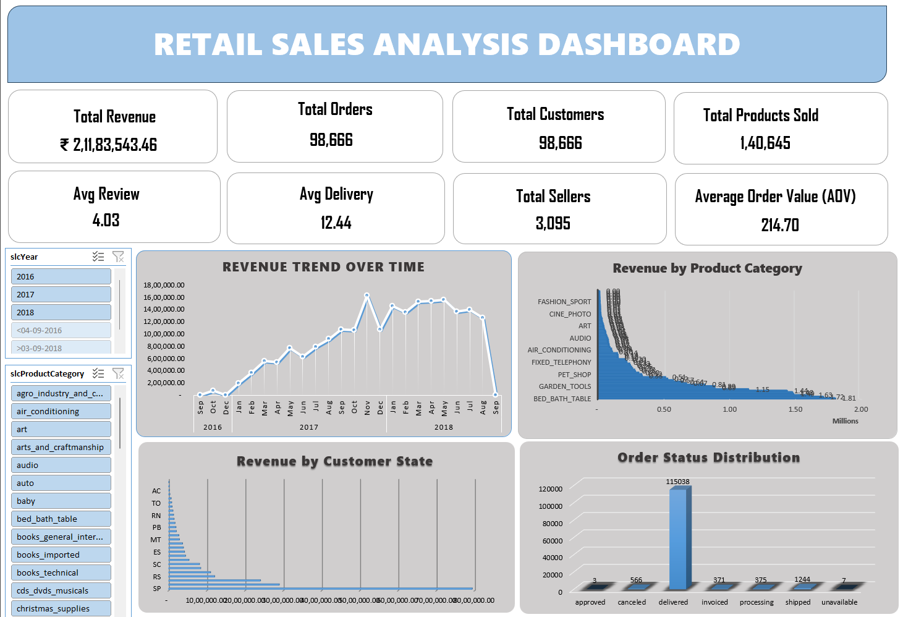
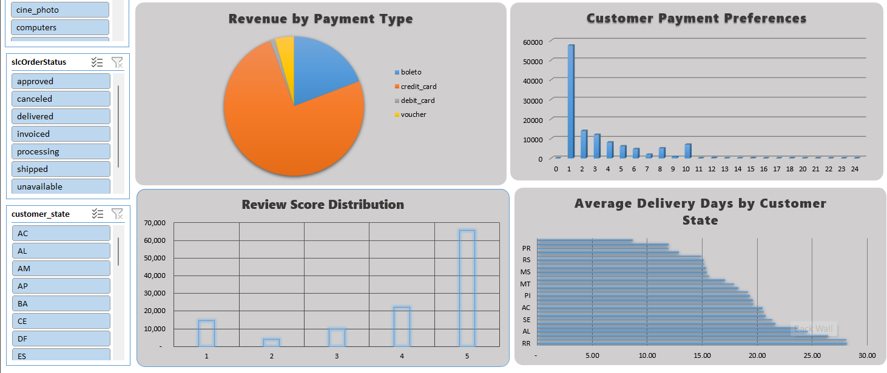

# 📊 Retail Sales Analysis Dashboard (Microsoft Excel)

## 📌 Project Overview

This project demonstrates an end-to-end Retail Sales Analysis Dashboard built entirely in Microsoft Excel 2021. The dashboard provides interactive insights into sales performance, customer behavior, payment trends, logistics, and customer satisfaction using Power Query, Pivot Tables, Pivot Charts, and Slicers.

The project follows a complete Business Intelligence workflow—from raw relational datasets to an executive dashboard.

## 🎯 Project Objectives

- Analyze sales performance over time
- Identify top-performing product categories
- Analyze customer purchasing behavior
- Evaluate payment methods and installment preferences
- Monitor order fulfillment status
- Measure customer satisfaction
- Analyze delivery performance across customer states
- Build an interactive dashboard for business decision-making

## 🛠 Tools & Technologies

- Microsoft Excel 2021
- KPIs
- Power Query
- Pivot Tables
- Pivot Charts
- Slicers
- Excel Tables

## 📂 Dataset

**Dataset:** Brazilian E-Commerce Public Dataset (Olist)

The project uses nine relational datasets:

- Customers
- Orders
- Order Items
- Products
- Sellers
- Payments
- Reviews
- Geolocation
- Category Translation

## 🔄 ETL Process

The following ETL workflow was implemented using Power Query:

1. Imported all datasets into Power Query.
2. Corrected data types.
3. Merged relational tables.
4. Aggregated Payments to avoid one-to-many duplication.
5. Aggregated Reviews to maintain one review per order.
6. Converted Portuguese product categories to English.
7. Created a consolidated Master_Data table.
8. Loaded cleaned data into Excel.

## 📊 Dashboard KPIs

- Total Revenue
- Total Orders
- Total Customers
- Products Sold
- Average Order Value
- Average Review Score
- Total Sellers
- Average Delivery Days

## 📈 Dashboard Visualizations

- Revenue Trend Over Time
- Revenue by Product Category
- Revenue by Customer State
- Order Status Distribution
- Revenue by Payment Method
- Payment Installment Distribution
- Review Score Distribution
- Average Delivery Time by Customer State

## 🎛 Dashboard Features

- Interactive Slicers
- Dynamic Pivot Charts
- KPI Cards
- Executive Dashboard Layout
- Interactive Filtering

## 📌 Key Business Insights

- Revenue is concentrated in a few product categories.
- Most customers prefer single-installment payments.
- Credit Card contributes the highest payment revenue.
- Most orders are successfully delivered.
- Customer satisfaction is generally high.
- Delivery performance varies across customer states.
- Revenue is concentrated in major customer states.
- Sales show consistent business growth over the analyzed period.

## 🧠 Skills Demonstrated

- Data Cleaning
- ETL
- Data Transformation
- Data Integration
- Power Query
- Pivot Tables
- Pivot Charts
- Dashboard Design
- KPI Development
- Business Intelligence
- Data Visualization
- Technical Documentation

## 📁 Repository Structure

Retail-Sales-Analysis/
│
├── Retail_Sales_Analysis_Dashboard.xlsx
├── README.md
├── Documentation.pdf
└── Dashboard_images/
    ├── Image1.png
    └── Image2.png

## 📷 Dashboard Preview

## 👩‍💻 Author

**Sahana**

Aspiring Data Analyst

Skills: Microsoft Excel • Power BI • Tableau • Machine Learning • Python • SQL

## 📄 License

This project is for educational and portfolio purposes.

